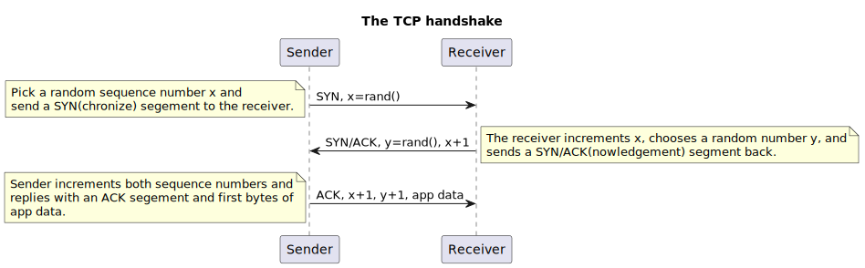

# The Study Guide
Welcome to my personal study guide for leetcode problems and systems design.

- [The Study Guide](#the-study-guide)
- [Data structures and algorithms](#data-structures-and-algorithms)
  - [Runtimes](#runtimes)
    - [Summary](#summary)
    - [O(1)](#o1)
    - [O(logN)](#ologn)
    - [O(KlogN)](#oklogn)
    - [O(N)](#on)
    - [O(KN)](#okn)
    - [O(N + M)](#on--m)
    - [O(|V| + |E|)](#ov--e)
    - [O(NlogN)](#onlogn)
    - [O(N^2)](#on2)
    - [O(2^N)](#o2n)
    - [O(N!)](#on-1)
    - [Amortized time complexity](#amortized-time-complexity)
    - [Tricks](#tricks)
  - [Hash functions and hashmaps](#hash-functions-and-hashmaps)
    - [Common Hash Functions](#common-hash-functions)
    - [Pigeonhole principle](#pigeonhole-principle)
    - [References](#references)
  - [Sorting](#sorting)
    - [Summary](#summary-1)
    - [Go sort](#go-sort)
    - [Insertion sort](#insertion-sort)
    - [Selection sort](#selection-sort)
    - [Bubble sort](#bubble-sort)
  - [Trees](#trees)
    - [Terminology](#terminology)
    - [Binary trees](#binary-trees)
    - [Binary search trees (BST)](#binary-search-trees-bst)
    - [Balanced and unbalanced binary trees](#balanced-and-unbalanced-binary-trees)
    - [Tree traversal](#tree-traversal)
  - [Heaps](#heaps)
    - [Go heap](#go-heap)
  - [Depth first search](#depth-first-search)
  - [Backtracking](#backtracking)
  - [Graphs](#graphs)
  - [Dynamic programming (DP)](#dynamic-programming-dp)
    - [How to solve DP](#how-to-solve-dp)
    - [Tricks](#tricks-1)
  - [Disjoint union set (DSU)](#disjoint-union-set-dsu)
  - [Intervals](#intervals)
- [Systems design](#systems-design)
  - [Communication](#communication)
    - [The Internet protocol suite](#the-internet-protocol-suite)
    - [Border gateway protocol (BGP)](#border-gateway-protocol-bgp)
    - [User datagram protocol (UDP)](#user-datagram-protocol-udp)
    - [Reliable communications](#reliable-communications)
      - [Opening and the TCP handshake](#opening-and-the-tcp-handshake)
      - [Closing and the TIME\_WAIT](#closing-and-the-time_wait)
      - [Established connections and congestion control](#established-connections-and-congestion-control)
    - [Secure communications](#secure-communications)
      - [Encyption](#encyption)
      - [Authentication and certificates](#authentication-and-certificates)
      - [Data integrity](#data-integrity)
    - [Discovery and DNS](#discovery-and-dns)
    - [Application programming interfaces](#application-programming-interfaces)
      - [Synchronous responses](#synchronous-responses)
      - [Asynchronous responses](#asynchronous-responses)
  - [Scalability](#scalability)
    - [Replication](#replication)
      - [Consistency models](#consistency-models)
        - [Linearizability](#linearizability)
      - [Strong consistency](#strong-consistency)
        - [Sequential consistency](#sequential-consistency)
        - [Causal consistency](#causal-consistency)
          - [The CALM theorem](#the-calm-theorem)
        - [Back to causal consistency](#back-to-causal-consistency)
        - [Eventual consistency](#eventual-consistency)
    - [CAP and PACELC theorems](#cap-and-pacelc-theorems)
    - [HTTP caching](#http-caching)
    - [Load balancing](#load-balancing)
      - [Load balancing strategies](#load-balancing-strategies)
      - [Layer 4 and 7 load balancing](#layer-4-and-7-load-balancing)
      - [Load balancing failover](#load-balancing-failover)
    - [Forward and reverse proxies](#forward-and-reverse-proxies)
    - [Content delivery networks (CDN)](#content-delivery-networks-cdn)
      - [CDN networks](#cdn-networks)
      - [CDN caching](#cdn-caching)
      - [Push and pull CDNs](#push-and-pull-cdns)
  - [Reliability](#reliability)
    - [Service level terminology](#service-level-terminology)
- [Napkin math](#napkin-math)
  - [Costs](#costs)
  - [Uptime in nines](#uptime-in-nines)
  - [Sorting](#sorting-1)
  - [Data storage](#data-storage)
  - [Networking](#networking)
  - [Computations](#computations)
  - [DBs with SQL](#dbs-with-sql)
  - [DBs with NoSQL](#dbs-with-nosql)
  - [RAM disk providers](#ram-disk-providers)
  - [Storage devices](#storage-devices)
  - [Serialization](#serialization)
  - [Hashing](#hashing)
  - [Common HTTP status codes](#common-http-status-codes)
- [General references](#general-references)

# Data structures and algorithms
[Top](#the-study-guide)

## Runtimes
How long an algorithm takes to run for a given input. Also called "time complexity" or "TC" for short.

### Summary
Runtime | Name | Example
--- | --- | --- 
`O(1)` | Constant | Math, assignments
`O(alpha(N))` | Inverse Ackerman | Rare. Close to constant time; think O(4) at most. Appears is Disjointed Set Union.
`O(logN)` | Log | Binary search, binary search tree search
`O(KlogN)` | K linear | K binary searches
`O(N)` | Linear | Traverse array, tree traversal
`O(KN)` | K Linear | Performing a linear operation K times
`O(N + M)` | Linear NM | Traverse array, tree traversal on two separate collections
`O(|V| + |E|)` | Graph | Traverse graph with V vertices and E edges
`O(NlogN)` | Sort | Quick and merge sort, divide n' conquer
`O(N^2)` | Quadratic | Nested loops
`O(2^N)` | Exponential | Combinatorial, backtracking, permutations
`O(N!)` | Factorial | Combinatorial, backtracking, permutations
`Amoritized` | Amoritized | High order terms that are rarely done, smaller order done more frequently. Like doing O(N^2) once at startup and O(logN) every other time.

### O(1)
Constant time. A constant set of of operations.
- Hashmap lookups due to pointer arithmetic magic
- Array access
- Math and assignments
- Pushing and popping from a stack

```go
// Some non-looping, non-recursive code
i = 1
i = i + 100000
fmt.Println("more constant time code")
```

### O(logN)
Log time. Grows slowly. log(1,000,000) is only about 20.
- Binary searches, due to constantly splitting solution space in half
- Balanced binary search tree lookups, again cause it's halved.
- Processing number digits
Unless specified, in programmer world, we mean log base 2.

```go
for i := N; i > 0; i /= 2 {
    // Constant time code
}
```

### O(KlogN)
Typically, when you need to do a log(N) process K times.
- Heap push/pop K times, like merging N sorted lists
- Binary search K times

### O(N)
Linear time. Typically, looping thru a data struct a constant number of times.
- Traversing an entire array or linked list.
- Two pointer solutions
- Tree or graph traversal due to visiting all the nodes or verts
- Stack and queue

```go
for i := 0; i < N; i++ {
    // Constant time code
}
```

### O(KN)
Typically, when you need to process N K times. Very exciting.

### O(N + M)
Typically, when you have two inputs of size N and M. Say you loop once N times and then loop M times.
Again, very exciting.

### O(|V| + |E|)
For both DFS and BFS on a graph, the time complexity is O(|V| + |E|), where V is the number of vertices and E is the number of edges. The number of edges in a graph could be 1 to |V|^2, we really don't know. So we include both terms here.

### O(NlogN)
When we need to do a logN time process N times.
- Divide and conquer, where divide is logN and merge is N
- Sorting can get down to this.

### O(N^2)
Quadratic time. Not terrible for N < 1000, but does grow quickly.
Usually, interviewers want better than this. If you've come up
with a N^2 runtime solution, there's probably something better.
- Nested loops, where outer and inner loops run N times

```go
for i := 0; i < N; i++ {
    for i := 0; i < N; i++ {
        // Constant time code
    }
}

// OR

for i := 0; i < N; i++ {
    for j := i; j < N; j++ {
        // Constant time code
    }
}
```

The bottom loop is tricky because it's a factor of N.
So it's N^2 too.

### O(2^N)
Grows very rapidly and often requires memoization to reduce runtime.
- Combinatorial problems, backtracking, and subsets
- Often involves recursion

Note, this one is harder to analyze at first.

### O(N!)
Grows insanely rapidly. Only solvable for small N and typically requires memoization.
- Combinatorial problems, backtracking, permuations.

Note, this one is hard to analyze/spot at first.

### Amortized time complexity
Amortized time, meaning to gradualy write off the initial time costs, if an operation is rarely done. For example, if we had N^2*N tasks, we could consider the solution O(N) instead of O(N^2) = N*O(1) * O(N) if we only do the N^2 task rarely. For example, if we dynamically size an array one time at startup.

### Tricks
Note that, like the other runtimes, we ignore constant factors and lower order terms: 5N^2 + N = 5N^2 = N^2

Remember, N is sort of like infinity in math. It swallows
smaller N terms and constants. Unlike infinity, it does not swallow up other terms if multiplication is involved.
- 2N -> N
- N + logN -> N
- NlogN -> NlogN
- 3N^3 + 2N^2 + N -> N^3
- N^2 + 2^N + N! -> N!

## Hash functions and hashmaps
In short, a hash function converts arbitrary sized data into a fixed value, typically an Int32. For example, summing all integers in an arrary and mod'ing them by 100. We convert a bunch of data or text into a smaller, ergonomic number.

Typically, you don't have to write hash functions from scratch outside of, say, for GetHashcode for .NET objects or similar.

A hash collision occurs when a hash function generates the same hash value for different data.

A good hash function is typically:
- Fast to compute (low time complexity or runtime)
- Very low chance of collision
- All possible values have a somewhat equal chance of occuring.

### Common Hash Functions
Name | Description
--- | ---
SHA | Cryptographic hash. SHA-3 is the lastest. SHA-2 and -1 have vulnerabilities now.
Blake2 | An improvement over SHA-3, high speed and used in crypto mining.
Argon2 | Password hashing function designed to be resistant to brute force or dictionary attacks. Uses large amount of memory (memory-hard) to make attacks more difficult, for hackers using specialized hardward to crack passwords.
MurmurHash | Fast an efficient non cryptographic has. Useful for hash tables.
CRC | Cyclic redundancy check. Non cryptographic. Fast, but not used for security. Typically, the CRC is appended to messages, like HTTP, to check for corruption.
MD5 | Fast 128 bit hash, but no longer recommended for security.

### Pigeonhole principle
Collisions are unavoidable, so we need to design around it. For example, if "anne" and "john" created the same hash, we'd overwrite the same hashtable entry. To avoid this, we can use [separate chaining](https://en.wikipedia.org/wiki/Hash_table#Separate_chaining) or other strategies.

### References
[List of hash functions](https://www.geeksforgeeks.org/hash-functions-and-list-types-of-hash-functions/)

## Sorting
- Time complexity = The amount of time it takes to sort the collection as a function of the size of the input data, represented in big O notation. Basic sorting is usually N^2, advanced are usually NlogN.
- Stablility = If two elements have equal keys, then the order of these elements remains unchanged. This can be valuable for historical data, user expectations, or multi-criteria sorts where not sorting equal elements is important.
- In-place = The sorting algorithm sorts the input data structure without need to allocate additional memory to store the sorted results. This is valuable for large data sets.
- Simple = Simple algorithms are those that are relatively straightforward to implement with a one or two loops. The more complicated algorithms like quick and merge sort use divide and conquer strategies. This does not mean they are super easy to just bang out, however.
- Adaptable = Sometimes, input data are already somewhat sorted and we can minimize the number of comparisons that we need to make. For example, gnome sort is O(N) for an already sorted collection!
- Parallelizable = The sorting algorithm can divide the the sorting into subtasks that can be executed in parallel. Merge, quick, radix, and bucket sorts are all parallelizable due to divide and conquer.

### Summary
A summary of common algorithms, courtesy of ChatGPT.
| Algorithm            | Time Complexity (Worst Case) | Stable | In-Place | Adaptable | Parallelizable | Description                                              |
|----------------------|-----------------------------|-----------|----------|-----------|-----------------|----------------------------------------------------------|
| Bubble Sort          | O(n^2)                       | Yes       | Yes      | Yes       | Yes (limited)   | Repeatedly compares and swaps adjacent elements.          |
| Selection Sort       | O(n^2)                       | No        | Yes      | No        | Yes (limited)   | Repeatedly selects the minimum element and swaps with the current position. |
| Insertion Sort       | O(n^2)                       | Yes       | Yes      | Yes       | Yes (limited)   | Builds the sorted list one element at a time by inserting into the correct position. |
| Merge Sort           | O(n log n)                   | Yes       | No       | Yes       | Yes             | Divides the input into halves, recursively sorts them, and merges them. |
| Quick Sort           | O(n^2) (rare), O(n log n)    | No        | Yes      | Yes       | Yes (limited)   | Chooses a pivot, partitions the data, and recursively sorts the partitions. |
| Heap Sort            | O(n log n)                   | No        | Yes      | No        | Yes             | Builds a binary heap and repeatedly extracts the maximum element. |
| Shell Sort           | O(n log^2 n) (worst known)   | No        | Yes      | No        | No              | A variation of insertion sort with multiple passes and varying gap sizes. |
| Radix Sort           | O(nk) (k is the number of digits) | Yes  | Yes      | No        | Yes             | Processes digits or elements in multiple passes, each pass sorted independently. |
| Bucket Sort          | O(n^2) (worst case)           | Yes      | No       | Yes       | Yes             | Distributes elements into buckets and sorts each bucket independently. |

### Go sort
We don't typically author sort algorithms from scratch in production. Some computer scientist has implemented pattern defeating quick sort (pdqsort) for us so that we don't have to. In go, use `slices.Sort` or similar:
```go
arr := []int{5, 3, 1, 4, 2}
slices.Sort(arr)

// OR

cmp := func(a, b int) int {
  if a == b {
    return 0
  } else if a > b {
    return 1
  }

  return -1
}

slices.SortFunc(arr, cmp)
```

### Insertion sort
```go
func InsertionSort(arr []int) {
	for i := 1; i < len(arr); i++ {
		// This is the magic. j starts at the ith element and walks smaller elements to the front of the array.
		// So, while j-1 > j, swap it so that j-1 < j and decrement j. Note j > 0 cause we're doing j-1 stuff.
		for j := i; j > 0 && arr[j-1] > arr[j]; j-- {
			sliceutil.Swap(arr, j-1, j)
		}
	}
}
```

### Selection sort

### Bubble sort

## Trees
Trees are a type of graph composed of nodes and edges.
- Trees are acyclic, nodes don't loop back to themselves and create cycles.
- There's a path from the root node to any other node.
- Trees have N-1 edges, when N is the number of nodes.
- Nodes have exactly one parent node.
- Trees are directed.
- Trees are rooted.

### Terminology
Name | Description
--- | ---
Root node | The top most ancestor node, one with out any parents.
Internal node | Every node that has at least one child.
Leaf node | Every node that does not have any children.
Ancestor | All nodes between the path from the child to the parent.
Descendent | All nodes between the path from a parent to the child.
Level | Number of ancestors from the current node to the root.
Arity | Number of operators or terms. For trees, where each node has no more than N-ary children.

I dislike ancestor/descendent. Call 'em parent and child like we're all 5 years old.

Example of a tree:
```
    A
   / \
  B   C
 / \   \
D   E   G
```
- A through G are all nodes.
- / and \ are edges. There's N-1 = 6-1 = 5 edges and 6 nodes.
- A is the root node.
- D, E, and G are all leaf nodes.
- A, B, and C are internal nodes.
- A is at level 0, B and C at level 1, and D, E, and G at level 2.
- A is a parent of B and C. B is a parent of D and E. C is a parent of G. D, E, and G are leaf nodes and have no children themselves.
- D and E are a child of B. G is a child of C. B and C are children of A. A is the root node and has no parents.

### Binary trees
Binary trees are a tree where each node has 0 to 2 children.

A full binary tree is one in which every node has 0 or 2 children. 1 is not allowed.
```
      x
     / \
    x   x
   / \
  x   x
 / \
x   x
```

A complete binary tree is where all the levels, except the last, are completely filled out. In the last level, the nodes are as far left as possible. This shows up in heaps.
```
      x
     / \
    x   x
   / \
  x   x
```

A perfect binary tree is one in which all the internal nodes have exactly 2 children. 1 or 0 are children are not allowed. All leaf nodes have the same number of children.
```
       x
     /   \
    x     x
   / \   / \
  x   x x   x
```
Perfect trees are used to estimate time complexity for combinatorial problems where the search space is a perfect binary tree. They have some unique properties.
- The number of nodes is 2^L-1 where L is the number of levels.
- The number of internal nodes is # of leaf nodes - 1.
- The total number of nodes is = 2 * leaf nodes - 1.

### Binary search trees (BST)
BSTs are a special type of binary tree where all left descendents < node < all right descendents.
```
      8
     / \
    3   10
   / \    \
  1   5    14
       \
        7
```
Notice that 3 is to the left of 8 because 3 < 8. Similarily, 14 is to the right of 10.
Note that the in-order traversal of the tree visits the nodes in monotonically increasing order.

### Balanced and unbalanced binary trees
Unbalanced trees are have a search time of N. The start to look more like a list than a tree.
```
1
 \
  2
   \
    3
     \
      4
```
Balanced binary trees are those where the difference in height (levels) between the left and right subtrees of all nodes is not more than 1. Balanced trees allow for a search time of logN.
```
      8
     / \
    3   10
   / \    \
  1   5    14
       \
        7
```

Balanced binary trees include [red-black](https://en.wikipedia.org/wiki/Red%E2%80%93black_tree) and [AVL](https://en.wikipedia.org/wiki/AVL_tree) trees.

### Tree traversal
Tree traversal are types of traveling through the nodes of a tree.
- In-order visits the left branch, current node, then right branch.
- Pre-order visits the current node, left subtree, and right subtree.
- Post-order visits the left subtree, right subtree, and current node.

For example, given the following binary search tree,
```
     8
    / \
   3   10
  / \    \
 1   5    14
      \
       7
```
the visits to each node would be:
- In-order: 1 3 5 7 8 10 14
- Pre-order: 8 3 1 5 7 10 14
- Post-order: 1 7 5 3 14 10 8

## Heaps
A min heap is a special tree data structure where
1. Almost complete - every level in the tree is almost filled, except the last level. The last level is left justified.
1. Each node has a greater key (priority) than it's parent.

Here's a heap structure:
```
       1
     /   \
    2     3
   / \   / \
  7   8 9   11
  |
  12
```

This is not a heap:
```
       1
     /   \
    2     3
   / \   / \
  7   8 9   11
  |
  5 // Need to heapify this, 5 < 7, so our heap property is broken
```

Also, not a heap:
```
       1
     /   \
    2     3
   / \   / \
  7   8 9   11
      |
      12 // Need to left justify this
```

Also, not a heap:
```
       1
     /   \
    2     3
   / \   /
  7   8 9 // Need to fill intermediate levels
  |
  12
```

Couple notes:
- Priority queue is an abstraction over a heap, minheap and maxheap are the concrete implementations.
- Max heaps are the same, but we just change the each-child-key-is-greater property to each child is less.
- Usually, heaps are binary tree, but you can also get k-ary heaps or k-heaps.
- A priority queue is an abstraction on the heap, a min/max heap is the concrete implementation.
- They are typically implemented with an array.
- It's a sorted tree but it is not a binary search tree.

Heaps support three main operations:
1. Heapify - Rearrange the nodes such that the heap such that the nodes are in min keys are always the at the root. This is an O(logN) operation.
2. Insert - Inserts a new element into the heap and calls heapify because to maintain the heap properties. This is an O(logN) operation.
3. Pop/Delete - Removes and returns the min root element. Another O(logN) operation.

In it's use, it's sort of like a stack. Push nodes in, pop nodes out except you always get the min keyed node.

### Go heap
Like sorting, we don't have to author heaps from scratch in go.
For example, we can alias a slice type and implement heap.Interface on it:
```go
// Alias a slice type
type MinHeap []int

// And implement the heap.Interface type.
var _ heap.Interface = (*MinHeap)(nil)

func (h *MinHeap) Len() int {
	return len(*h)
}

func (h *MinHeap) Less(i int, j int) bool {
	return (*h)[i] < (*h)[j]
}

func (h *MinHeap) Pop() any {
	result := (*h)[h.Len()-1]
	*h = (*h)[:h.Len()-1]
	return result
}

func (h *MinHeap) Push(x any) {
	*h = append(*h, x.(int))
}

func (h *MinHeap) Swap(i int, j int) {
	(*h)[i], (*h)[j] = (*h)[j], (*h)[i]
}

func TestHeap(t *testing.T) {
	// Create an empty MinHeap
	h := &MinHeap{}

	// Push elements onto the heap h, using heap.Push(h, whatever)
	heap.Push(h, 3)
	heap.Push(h, 1)
	heap.Push(h, 4)
	heap.Push(h, 2)

	// Pop elements from the heap h (retrieve in sorted order for a min-heap)
	// using the heap.Pop(h)
	for h.Len() > 0 {
		fmt.Printf("%d\v", heap.Pop(h))
	}
}
```

## Depth first search
A depth first search (DFS) looks for solutions by going deep first. That is, it searches for solutions in a pre-order traversed way. Some more terminology:
- Backtracking - returning after visiting a non-solution node
- Divide and conqueror - When we have two or more recursive calls, that splits our issue into subproblems, like O(logN).

When do we use a DFS? We can use them in
1. Trees
  - Traverse through a tree to find, create, delete nodes
  - Traverse through a tree to find the max subtree, detect a balanced tree, etc.
2. Combinatorial problems
  - Find all the different ways of arranging something
  - Find all possible combinations of something 
  - Find all solutions to a puzzle
3. Graphs
  - Find a path from A to B in a graph
  - Find connected components
  - Detect cycles

There are two main ways of coding a DFS. We can use recursion or we can use a stack + loop.
1. With recursion, we call the recursive func on the next state.
2. With a loop, we pop off a stack, add any possible solutions, and then keep going.

One thing to keep in mind with DFS, is kicking state into and out of the recursive functions and/or stack.

The template for a DFS via recursion is
```
function dfs(node, state):
    if node is null:
        ...
        return

    left = dfs(node.left, state)
    right = dfs(node.right, state)

        ...

    return ...
```

The main hard parts of DFS are 1. deciding which state to pass in, 2. deciding which state to pass out and 3. sorting out the recursive calls.

Now, sometimes, when solving DFS problems, we need to
- Pass information back up through the return value, like the max depth.
- Pass information about state into the recursive calls, like max value
Alternatively, we can store state, say a max number, in a global variable.

## Backtracking
Backtracking tacks on some new concepts on top of trees and DFS.
1. We can make the tree as we go, creating and deleting child nodes as we traverse through.
2. We can drag state around via parameters/returns or with global/struct variables.
3. If we get some crazy 2^N to N! memory usage with backtracking combinatorial problems, we may need to memoize intermediate solutions to cut down on memory usage. For a small to mid N, N! will kill our poor computer. Memoize typically means using a map or similar to store intermediate and final solutions to the combinatorial problems.

## Graphs
Trees are rooted, connected, acyclic, undirected graphs. Trees contain N nodes and N-1 edges and there are only one path between 2 nodes.

This is a tree (and a graph):
```
    1
   / \
  2   3
 /
4
```

This is only a graph due to the cycle and disconnected vertex.
```
    1
   / \
  2 - 3   // Cycle among nodes 1, 2, and 3

4         // Node 4 is disconnected from others
```

Trees and graphs have different terminology
- Verticies are nodes in trees.
- Verticies are connected by edges.
- Verticies connected by an edge are neighbors (children and parents in trees).
- Edges can be directed or undirected. Usually the edges are undirected.
- Paths are sequences of verticies. Cycles start and end at the same vertex.
- A connected graph means every vertex is joined by a path to a vertex; otherwise, the graph is disconnected.

Typically, graphs are stored via adjaceny lists or maps. For example, this graph
```
    1
   / \
  2   3
 /
4
```

can be represented in go via a map like

```go
graph := map[int][]int{
  1: {2, 3},
  2: {1, 2, 3},
  3: {1, 2},
  4: {2},
}
```

Note that we don't need to have an adjacency list upfront to solve problems.

So, for BFS and DFS on the graph, we can do the stack/queue dance through it. However, we need a way to dodge any cycles or we'll get stuck in an inf loop or stack overflow. To do this, we can store a map of visited nodes when searching. Like

```go
visited := make(map[int]bool)
visited[1] = true
```

Another clever trick is to wipe out the value in the adjancency graph somehow. Make it negative or something that indicates we visited it to avoid storing a whole other data structure for visited/not-visited stuff.

When deciding between BFS or DFS to explore graphs, choose BFS for shortest distance or graphs of unknown or infinite sizes due to exploring all adjacent neighbors first.

DFS is better at using less memory for wide graphs (graphs with large breadth of factors). Put another way, BFS stores the breadth of the graph as it searches. DFS is also better at finding nodes that are far away such as a maze exit.

## Dynamic programming (DP)
A problem can be solved via dynamic programming if
1. The problem can be divided into sub-problems
2. The sub-problems from bullet 1 overlap

Really, DP == DFS + memoization + pruning. Pruning is important, to save space and reduced wasted calculations.

In DP, the formula used to tabulate Fibonacci numbers is `dp[i] = dp[i - 1] + dp[i - 2]`. These formulas are called the recurrene relation and is critical. Without this, you'll end up flailing around. They also, aren't super obvious. Take finding the longest increasing subsequence (LIS). The recurrence relation from top-down is `lis(i) = max(lis(i-1), lis(i-2) ... lis(0))` but only for `nums at i-1, i-2, ..., 0 < num at i`.

DP problems can be solved in top-down or bottom-up.

### How to solve DP
1. Identify if we've got overlapping problems or not. If they don't overlap, DP ain't going to work.
2. Sometimes, they don't just hand you an array to run DP on. For example, see the [perfect squares problems](./problems/dynamic/perfectsquares_test.go). In that problem, we need to churn out the perfect squares 1, 4, 9, 16, 25, 36, etc. to get started.
3. Half the battle is just determining what goes into the memo. For *most* problems, we memo the same thing as the problem's output. Again, DP is combining solutions to subproblems to create the final answer. Maybe this is completely obvious, but when you're staring down some crazy confusing leetcode problem for the first time, it helps to remember this.
4. And, sometiems, you might need to sort the input collection or operate on it in some way. See the [longest divisible subset problem](./problems/dynamic/largestdivsubset_test.go). In that problem, the TC from the solution is N^2 and sorting is NlogN, so this is "fine" to do.
5. After you identify the memo and what it stores, we can typically init the memo with the base cases. For example, in the [perfect squares problem](./problems/dynamic/perfectsquares_test.go), we can init the memo with 1, 4, 9, 25, etc. while less than our target number.
6. Next, you'll need to figure out how to get from `dp[0]` to `dp[1]`. We start to author the recurrence relation, the math formula that get's us the answers from `something[i]` to `something[i+1]`. These don't need to be written like a math PhD would write. Something *you* can understand for coding like:
```
The recurrence relation is:
memo[i] = max(memo[i-1], memo[i-2]... memo[0])+1
  but ONLY for each memo[i-1] when nums[i]%nums[i-1]==0.
```

### Tricks
- If a sequence length is relatively small, say under 3000 elements or so, it may suggest DP due to N^2 or worse time complexity. So, small inputs, may mean DP because the tests will never finish otherwise.

## Disjoint union set (DSU)

## Intervals
```
start1-----end1   // Some interval 1

    start2-----------end2    // Some other interval 2

                           start3-----end3    // Yet another interval 3
```
We can determine if intervals 1 and 2 overlap if `end1 >= start2 && end2 >= start1`. Notice that the formual returns false for intervals 1 and 3.

# Systems design
[Top](#the-study-guide)

1. The network is reliable;
2. Latency is zero;
3. Bandwidth is infinite;
4. The network is secure;
5. Topology doesn't change;
6. There is one administrator;
7. Transport cost is zero;
8. The network is homogeneous.
From [Fallacies of distributed computing](https://en.wikipedia.org/wiki/Fallacies_of_distributed_computing)

## Communication
[Top](#the-study-guide)

### The Internet protocol suite
Here's a model of the abstraction layers of the internet. To be blunt, these layer models are totally bogus; however, they are helpful for conceptualizing the layers of abstraction in Internet communications.


- The **link layer** operates on local network links like Ethernet or WiFi and provides interfaces to the underlying network hardware. Switches operate at this layer and forward Ethernet packets based on their MAC addresses.
- The **internet layer** routes packets based on their IP address. The IP protocol is core at this layer. Packets are delivered on a best-error can can be dropped, duplicated, corrupted, or arrive out of order. Routers work at this layer, forwarding packets along based on their IP. Note that MAC addresses allow packets to be forwarded from one machine to the next. IP addresses provide the start and end machines.
- The **transport layer** transmits data between two processes. There are many processes on a machine that want to communicate and they do so through port numbers. TCP protocol is used at this layer and attempts make a reliable channel over an unreliable one (lol). Segments are given a number which lets the receiver know if packets are dropped, duplicated, or arriving out of order.
- The **application layer** defines the high level communications like HTTP or DNS. Often, this is the target abstraction for our work.

There are other layers: physical and data link. We'll briefly not them here:
- Physical concerns itself with voltages, pins, cabeling, wireless frequencies, etc.
- Data link conerns itself with providing frames for the raw bits and provides some error correction/detection.

Also, TCP is on it's way out and being replaced by [QUIC](https://en.wikipedia.org/wiki/QUIC), aka TCP/2, which multiplexes connections between two endpoints using UDP.

### Border gateway protocol (BGP)
Building and communicating routing tables lies with BGP. BGP maps out routes for forwarding packets along. Note that BGP is concerned about the minimum number of "hops"; it doesn't concern itself with congestion or latency.

ChatGPT says,
> "Absolutely! Let's imagine the internet is like a big neighborhood with houses (which are computer networks) that want to talk to each other. Now, each house has its own unique address, just like how each computer network on the internet has its own address.

Now, Border Gateway Protocol, or BGP, is like the system that helps these houses (networks) know how to talk to each other. Imagine if you want to send a letter to your friend's house in another part of the neighborhood. You need to know the best way to get there, right?

BGP is like the map of the neighborhood for the internet. It helps all the houses (networks) figure out the best paths to reach each other. Just like how you might have different routes to get to different places in your neighborhood, BGP helps networks find the best routes to send information (like emails, pictures, or web pages) to each other.

But here's the tricky part: BGP doesn't know about all the small streets and houses. It mainly knows about the big roads and major intersections (these are like the main connections between different internet providers). So, when a house wants to send something to another house, BGP helps them find the best path using these big roads.

However, just like in a big neighborhood, sometimes things can change. Maybe a road is under construction, or a new road is built. BGP needs to quickly figure out these changes and update the map so that everyone can still send their information along the best paths.

So, in simple terms, BGP is like the map that helps computer networks on the internet find the best paths to talk to each other, just like you finding the best way to get to your friend's house in your neighborhood."

### User datagram protocol (UDP)
An alternative to TCP is UDP, a connectionless protocol that only sends discrete packets of a limited size. It's barebones and offers no reliability guarantees. UDP bootstraps other protoocls, that want some but not all of TCP's guarantees.

Online multiplayer video games or video streaming may leverage UDP. There's no value in retryin, it would only degrade the user experience.

### Reliable communications
TCP uses segements (not packets) that let receivers detect missing, duplicate, corrupted, and out of order data. Each segement is associated with a timer; if a receiver does not acknowledge the segment, it is resent.

Operating systems manage the **sockets** the store connection states: opening, established, closing. There are more than 3 states, but this keeps it simple.

#### Opening and the TCP handshake
The TCP handshake introduces a full round-trip before any app data is sent. Until a connection is opened the bandwidth is effectively zero. The faster a connection is established, the sooner communication can begin. Ergo, reducing round-trip time by moving servers next to each other reduces the cold start penalty.



Closing the connection, on the other hand, involves multiple round-trips. Additionally, if another connection might occur soon, it doesn't make sense to close the connection so it might stay open.

#### Closing and the TIME_WAIT
Sockets, and the resources they consume, do not immediately close. The enter a waiting state, where late arriving segments are dropped, so that they aren't considered part of a new connection. If you try to open and close many sockets (ports) in a tight loop, you can hit resource exhaustion on ports.

#### Established connections and congestion control
Once communication is started, the sender tries to avoid bombing the receiver with a ton of data. The receiver will shoot back it's buffer size to the sender, so that it doesn't get overwhelmed. TCP is rate-limited just like rate limiting on API key or IP address.

TCP will also try to avoid crushing the underlying network with a ton of traffic. The sender will hold onto a congestion window that'll track the number of segments without ackowledgement. When a segment is acknowledged, the sender can increase the traffic; when not acknowledge, the window is decreased. In fact, bandwidth can be represented by `bandwidth = window_size/round_trip_time`.

### Secure communications
TCP/IP does nothing to secure communications. We need to secure against:
- Spying on data (encryption)
- Unknown or wrong sender/receiver of data (certificates)
- Accidental or malicious changes to data (message auth code via SHA or similar)

Transport layer security (TLS) swoops in, runs on top of TCP, and provides encyption, authentication, and data integrity.

#### Encyption
Encryption means that the data are obfuscated and can only be read by the receivers. When TLS starts, the server and client swap public keys for asymetric encryption. There's a really great blog on the subject [here](https://blog.cloudflare.com/a-relatively-easy-to-understand-primer-on-elliptic-curve-cryptography/). Once the keys are sent, both sender and receiver use symetric encryption which is faster and cheaper to minimize overhead. Note that
- The shared keys are regenerated periodically to maintain safety.
- Bascially all traffic should use encryption due to modern CPUs having cryptographic instructions.

Note that the TCP handshake runs first, then followed by the TLS handshake. QUIC aims to speed this along some.

(Diagram by By Sedrubal - Own work, CC BY-SA 4.0, https://commons.wikimedia.org/w/index.php?curid=114587250)

#### Authentication and certificates
Even though we can secure communications, we still need to verify that the server is who it claims to be. This is done via certificates which include data about the owner, expiration, public key, and digital signature. The folks that grant certificates are called certificate authorities or CAs.

Certificates need to be present in the client in the client's trusted store. A trust store, also known as the certificate store, is a repository of certificates that the client trusts.
1. The server presents the certificate during TLS/SSL handshake
2. The client verifies the certificates, working up the certificate chain. It'll verify the certificates are valid and not expired.
3. The client will decide if the server is trustworthy. If not, it'll terminate the connection and/or display a warning message.
4. If all is good, the connection may proceed.

Here's an example of a certificate:
```
-----BEGIN CERTIFICATE-----
MIIDdzCCAl+gAw (a lot more garbled text follows)...
-----END CERTIFICATE-----
```

Key values in the certificate are:
- **Version** of the X509 standard being used. Like version 3.
- The unique **serial number** of the certificate.
- The certificate authority that **issued** the certificate, aka, the issuer.
- **Validity period** states when the certificate is valid.
  - **Not before** some date, indicating when the certificate starts being valid
  - **Not after** some date, indicating when the certificate stops being valid
- **Subject** indicates which entity the certificate is issued for.
- The **public key** associated with the certificate and can be exchanged during TLS handshake.
- The **signature algorithm** used by the certificate authority to sign the certificate.
- A digital **signature** used to verify the authenticity of the certificate.

Now, each certificate is chained to an issuing identity, another CA, that granted the certificate. This creates a chain of certificates. The top-level, final certificate is the root CA, like Let's Encrypt.

Here's an example of a website (service), intermediate, and root CA chain.


We use a chain of certificates because:
1. It creates a hierarchy of trust. Root CAs are typically installed into a client's OS.
2. Allows client to verify the entire chain. If any one certificate is unreliable, the whole chain is considered untrustworthy.
3. We don't need to have 10 billion certificates stored in every client. The keys are distributed around.
4. New intermediate CAs can be added easily, making things scale nicely.

Note that a common mistake is to let the certificates expire, a single point of failure for your whole web stack's security. This'll cause all clients to not trust you. Automating certificate replacement is worth the effort at scale.

#### Data integrity
With encryption we can prevent others from reading the data. With authentication we can prove who we're talking with. However, even with all this, bits could get flipped accidentally or maliciously. A hash-based message authentication code (HMAC) is sent along during TLS. Note that TCP's checksum can fail to detect errors for 1 in 16 million to 1 in 10 billion packets. So, with packets of 1KB in size, it happens once in 16 GB to 10 TB of data transmitted.

### Discovery and DNS
So, IP addresses are cool and all, but we need a way to lookup the IP addresses of servers. There's 2^128 IPv6 and 2^32 IPv4 addresses. Good luck remembering them. Worse yet, IP addresses of servers change all the time. Sometimes the admins need to move requests to a different cluster or spread load among many clusters. DNS helps with this.

Funnily enough, DNS is its own layer 7 protocol.

Anyway, the get-ip-address-from-domain-name is done via Domain Name System (DNS) and DNS resolution.

We're going from `www.amazon.com` to `192.0.2.1` in IPv4 or `2001:d68::1` in IPv6.

You can, of course, slap a port and IP address into the URL bar, but that's a lot of work. Instead we can take the domain name like something.com and resolve it into its IP address 1.2.3.4.

1. If it's a new domain name, the packets are routed to your ISP's DNS resolver. Your browser will cache IP addresses for domain names to save time.
2. The ISP's resolver will iteratively resolve the hostname for clients. It will also cache results.
3. If the ISP's resolver doesn't have it, it'll send a query to the root name server (NS). Root NS map the top-level domains (TLD) of the request, like `.com`. It'll give the address of the TLD server.
4. Once the ISP's resolver has the `.com` part, it'll query the TLD name server with `something.com`. This is the iterative part where the ISP's name resolver will iterate a lot.
5. The TLD name server maps `something.com` to an authorative name server responsible for the domain.
6. We can return the IP address of `something.com` finally.
7. If there's an optional subdomain, like `definitely.something.com`, then the name server would return the authorative name server for the subdomain and the process keeps going.

Again, the results are typically cached along the way. Similar to HTTP caching, DNS results are cached with a time to live (TTL) for how long the result is valid for. And, like HTTP caching, we can get some eventual consistency problems that surface. If the cache TTL is too long, then clients will try to connect to the wrong IP address. If the cache TTL is too short, you'll increase DNS load and increase avg response times for clients due to the several round trips DNS takes.

In terms of resiliency, DNS is single point of failure since normal humans simply won't find the IP address of your server and type it in to the browser URL. If, there's a failure and the TTL is stale, we could still try returning the stale result. Continuing to operate or partially operate while a dependency is down is called static stability.

Note that DNS used to be in plaintext, but now it uses TLS. Yay.

[This video](https://www.youtube.com/watch?v=drWd9HIhJdU) is a deep dive.

### Application programming interfaces
Once we can create semi-reliable and secure connections, we can finally discuss having the client invoke operations on the server. Typically, this is done through ppplication programming interfaces (APIs). APIs can be **direct** or **indirect**.
Term | Definition | Example
--- | --- | ---
Direct | Client communicates directly with a server. | Request-response over HTTP or gRPC. Client sends a `GET /hello`, server responds with `200 OK Hi!`.
Indirect | Client communicates indirectly with a server via a message broker. They don't communicate directly. | A message bus via RabbitMQ or Google's Pub/Sub. Client adds a message, including any optional data, and the server does some processing when it receives the message.

Data are serialized via JSON, Protobuf, or similar. XML too, but I suspect it's not as widely supported now. JSON is human readable but slower to serialize and deserialize. Protobuf is not human readable and faster to serialize and deserialize. It's all about tradeoffs.

Now, for clients and servers both, requests and responses can be handled in synchronously, asynchronously, or with a mix of both.

#### Synchronous responses
The server receives a request, does some processing, and returns the entire response immediately. This is typically appropriate when the response is under ~10 MB and can be processed by the server relatively quickly, say in under ~60 seconds. For example, getting a single product's details would typically be straightforward. Listing all products would also be suitable, but the client and server may have to perform paging to get the entire list.

#### Asynchronous responses
Similar to synchronus, the server receives a request, initiates processing, but only returns paritial or intermediate results. Clients will need to checkback later to determine when processing is completed and where to get the results. This is appropriate for long running processes greater than ~60s or those with greater than ~10MB of data may benefit from this. Clients may be able to poll the processing status or they could provide a postback for the server to call later.

## Scalability

### Replication
Distributed systems are often modeled around consistency models which define how the updates to a distributed system are observed. With different models, you may see data visibility, ordering of operations, performance differences, fault tolerance, ease of implementation, and ease of maintenance. In short, as a system becomes more available, it becomes less consistent.

#### Consistency models

##### Linearizability
Also known as atomic consistency. This is a specific form of strong consistency which adds real-time ordering constraints to operations.
- At some point, the operation appears to occur instantly, called the linearization point.
- This is a stronger form of consistency than strong (lol, great, not confusing at all) due to the stringent ordering.
- It's also probably the slowest due to the ordering, synchronizing, and coordination involved. Getting all the computers to agree (coordination) takes time.
- The emphasis is all on real-time ordering. When clients check back later, the linearized system updates the data between reads.

ChatGPT says,
> "Imagine you and your friend Alice have magical walkie-talkies. With linearizability, when you send a message to Alice, it's like she receives it instantly, and her response also comes back to you immediately. It's as if the messages are magically happening at the same time."

#### Strong consistency
Strong consistency ensures all nodes have the same view of data at any given time.
- All operations appear to be synchronous and read operations appear to return the most recent write.
- Typically uses distributed locks to agree on the order of operations.

ChatGPT says,
> "Strong consistency is like having a rule that everyone, including friends in different rooms, always has the same information at the same time. If you say something to Alice, all your friends instantly know about it. It's like the information spreads quickly to everyone."

##### Sequential consistency
Sequential consistency ensures operations occur in the same order for observers but does not make any real-time guarantees about when an operation's side effect becomes visible. There's a boost in performance but we drop some consistency on the ground. A read from Server A may appear different than Server B, but the operations are sequential so Server A and B will eventually converge and agree. In other words, the replicas are diverging on their view of the world.

A producer/consumer system, synchronized with a message queue, is an example of a sequential concistency. The consumer lags behind the producer.

ChatGPT says,
> "Now, let's say you and Alice have regular walkie-talkies, but you both agree to take turns talking. So, the messages go back and forth in the order you send them. It's like having a clear order for your conversation."

##### Causal consistency
Causal consistency relaxes some guarantees of strong in favor of speed. Causal guarantees that causally related operations are in a consistent order and preserves causality. Before we continue, we need to discuss the CALM theorem quickly. So, stay CALM (Get it? Stay calm!!? About the theorem? Funny, right?)

###### The CALM theorem
The Consistency As Logical Monotonicity (CALM) theorem uses logic to reason about distributed systems and introduces the idea of monotonicity in the context of logic. CALM tells us we can get to coordination-free distributed implementations only if the system is monotonic.

Logically monotonic means that the output only further refines the input and there's no taking back any prior input.

Very important note: The consistency in CALM is not the same as the consistency in CAP.

Variable assignment is non-monotonic. When you assign something to a variable, the previous value is gone forever. Take a counter value that does

write(1), write(2), write(3) => 3
but then if they show up out of order:
write(1), write(3), write(2) => 2

We end up with the wrong value.

In contrast, incrementing allows us to reorder in any way and still get the correct output:
increment(1), increment(1), increment(1) => 3

##### Back to causal consistency
Back to causal consistency. Causal maintains happend-before order (the causal order) among operations. This makes causal attrative for many applications because:
- It's consistent "enough" and easier to work on the eventual consistency.
- Allows building a system that's available and partition tolerant.

This requires that nodes *agree* on the causally related operations but may *disagree* on the order of unrelated ones. Put another way, the nodes preserve the logical order.

Causal systems are typically backed by conflict-free replicated data types (CRDTs), such as
- Last writer wins (LWW) - Values are associated with a logical timestamp/version. When the value is broadcasted, nodes only keep the greatest timestamp. Conflicts due to concurrent updates are usually resolved by taking the greater timestamp, but this might not always make sense.
- Multi-value (MV) - Store the operations in a log of operations that all nodes share. New values are inserted into the MV register. Systems will need to share out their MVs.

ChatGPT says,
> "With causal consistency, you and your friends agree on some logical order for the messages. If you tell something important to Alice and then mention it to Bob, everyone knows that Alice got the message first. It's about maintaining the cause-and-effect relationship."

##### Eventual consistency
Eventual consistency relaxes guarantees of strong and sequential. Given enough time, all nodes will converge to the same result. Note that, during updates or partitions, nodes may have different values. For example, reading from Server A and B may yield a stale, earlier result which is very confusing.

Imagine uploading an image to a social network and add it to gallery. Except, when you try to view the gallery, you get a 404; strangely, you already received a message upload success message! Very odd to an observer, but very real in distributed world.

Regardless, eventual can be appropriate tradeoff for certain systems. Slightly different results are perfectly acceptable to achieve higher speeds such as returning the number of users on a website. The number of active users can be stale, and it's typically not a big deal. Note that eventual consistency can be a maintenance burden due to subtle, unexpected bugs.

ChatGPT says,
> "Now, suppose your friends have regular walkie-talkies, and sometimes messages take a while to reach everyone due to delays. Eventual consistency says that, given enough time without any more messages, eventually, everyone will have the same information. It's about waiting until things settle down."

### CAP and PACELC theorems
["CAP Theorem: You don't need CP, you don't want AP, and you can't have CA"](https://www.youtube.com/watch?v=hUd_9FENShA)

Engineering is, in part, about tradeoffs. Distributed systems are no different. CAP theorem, can be summarized as "strong consistency, availability, and partition tolerance: pick two of three." Except...
- Network partitions are simply unavoidable, so you really just get to pick between availability and consistency
- But, also, CAP defines available as *eventually* getting a response but we know that perfect availability is impossible
- And also a slow response is as bad as not receiving one at all.
- Network paritions are rare in a data center. It can certainly happen though.

So, while helpful, CAP is limited in its practical application. This is, again, about tradeoffs. The PACELC theorem, an extension of CAP, expresses this as, when a network is partitioned (P), choose between availability (A) and consistency (C). Else, when operating normally (E), choose between latency (L) and consistency (C). We see that this is not some binary choice between AP and CP, but rather a spectrum of tradeoffs between the various consistency models and latency. Indeed, some systems like [Azure's Cosmos DB](https://learn.microsoft.com/en-us/azure/cosmos-db/consistency-levels) allow you to choose the consistency model you want which is neat.

### HTTP caching
Static resources like CSS, JS, JSON, etc. don't typically change super often. The client's browser can cache the results which boosts response time, lowers server load, etc. In terms of APIs, only reads (GET and HEAD) are cacheable. The other verbs modify data.

The first time a client requests static resource, we can reply with the resource plus add a Cache-Control HTTP header with how long to keep the resource (time to live or TTL) and the ETag (resource version).


If the cache resource is stale (age > max-age), we'll request it from the server again. Otherwise, the next time the same resource is requested, we'll get it from the cache.


This is great because we simply added a HTTP header and reduced server load and boosted response time for the client. Unfortunately, we added eventual consistency, especially if the caching is poorly managed.

For example, in the worst cases, say the dev team changed an endpoint with a breaking change and updated the JavaScript that hits this endpoint. If the client is still using an old JavaScript file due to improper headers/caching, they'll get an error when trying to use the endpoint with the wrong JavaScript code. This will require clients to perform a hard reload, wait for the resource to expire, or simply try again and hope that the consistency is there.

Regardless, this is typically a good price to pay by being careful when using the cache, using cache-busting techniques, use CSS/JS/whatever hashcodes or versions like `<link rel="stylesheet" type="text/css" href="styles.css?hash=abcd1234">` or `<link rel="stylesheet" type="text/css" href="styles.css?v=1">`. Alternatively, we can force clients to retrieve static resources from different URLs.

Note that HTTP caching treats reads separate from writes like CQRS.

### Load balancing
[Top](#the-study-guide)

#### Load balancing strategies
Name | Description
--- | ---
Round robin | Sling requests to servers in order, one at a time. LB1 -> LB2 -> LB3 repeat.
Weighted round robin | Some servers are more powerful than others. We can give more requests to the stronger servers. Say LB2 is stronger, we could do LB1 -> LB2 -> LB2 -> LB3.
Least connections | Sometimes, a server might draw the short straw and get overwhelmed with a bunch of long running requests. This is a dynamic LB strategy where we give requests to servers with the least active of connections.
Weighted least connections | Similar to least connections. Servers are dynamically scored based on the servers resources.
Resource based (adaptive) | The LB can get health checks from the servers and their overall health. Scores and requests can be dynamically assigned based on the servers returned status check.
Resource based, (Software defined network adaptive) | Using OSI layers 2, 3, 4, and 7, the LB can make optimized traffic decisions based on network congestion or similar.
Fixed weighting | Servers are assigned a scored (weighted). The highest score will get the requests and then failover to the next highest score. This one is useful where a single server is expected to handle all the traffic but be assigned a failover server.
Weighted response time | The LB can use a server's response time to decide where to send traffic. The fastest server wins the next request.
Source IP hash | The source and destination IPs are hashed and used to direct requests. This one is useful if all requests need to go to the same server.
URL hash | Similar to source IP hash except the requested URL is used instead and helps ensure requests are sent to the same servers.

#### Layer 4 and 7 load balancing
Load balancers can make routing decisions based on information extracted from bytes in the TCP stream (transport layer 4) or from the HTTP header, cookies, or resource type (application layer 7). Note that, layer 4 vs 7 is talk here is intended to be more useful for learning than 100% accurate. It's more complicated than pick layer 4 vs 7 - done.

- Layer 4 requires less computing resources as there's less protocols to process, you maybe don't have to wait for the entire packet, etc.
- Layer 7 load balancing is often desired for sheer flexibility since, at layer 7, we have a full understanding of the request being made.

Typically, besides higher flexibility, hardware nowadays is powerful enough and to make layer 7 LBs outweigh layer 4 LBs.

#### Load balancing failover
A single LB presents a single point of failure. If the single load balancer goes down, then the whole system behind it goes down as well. To maintain availability, we can have multiple load balancers in active-active or active-passive configurations.
- Active-active = There are multiple, ready LBs in use. If one active goes down, then another is ready to take the additional load.
- Active-passive = One LB is active, another LB is in standby. The standby LB is ready to hop in if the active one goes down.

The more nines you need, the more LBs you'll need to supply.

References:
- [Load balancing algorithms](https://kemptechnologies.com/load-balancer/load-balancing-algorithms-techniques)

### Forward and reverse proxies
ChatGPT says,
> "Let's imagine you want to get a toy from a toy store, but instead of going there yourself, you send your friend to bring it back for you. In this scenario, your friend is acting like a proxy.

Now, there are two types of proxies: forward proxies and reverse proxies.

Forward Proxy (like your friend going to the store): Imagine you want to visit different toy stores, but you don't want the stores to know it's you every time. So, you send your friend to the stores, and your friend brings the toys back to you. The stores only see your friend, not you. This is like a forward proxy; it helps you access different things on the internet without directly interacting with them.

Reverse Proxy (like a helper at the toy store): Now, let's say you go to a huge toy store, and there's a helper at the entrance. Instead of going inside to get each toy yourself, you tell the helper what you want, and the helper gets the toys for you. The helper is like a reverse proxy because it helps you get what you need from the store without you having to go all the way in. In the internet world, a reverse proxy helps websites give you the things you want (like web pages or pictures) without you directly talking to the main server.

In summary, proxies are like helpers or friends that help you get things from different places, and reverse proxies specifically help websites give you what you want without you having to go to the main server every time."

### Content delivery networks (CDN)
CDNs are collections of caching servers. When clients request certain resources, like images or video, they can be served from physically close CDNs that cache the content. If the CDN doesn't have the resource, it'll request the content from the "origin server" (read: your application server) from the original URL. The resource is stashed locally and finally served to the client.

#### CDN networks
The main power of CDNs isn't the caching, it's actually the CDN network itself. BGP doesn't concern itself with latencies or congestion. CDNs can exploit and optimize various techniques to increase bandwidth. They have persistent connections and optimial TCP window sizes to maximize bandwidth.

Furthermore, CDN are optimized in terms of location and placement. There's a global DNS load balancing, an extension of DNS, that considers client location via IP address and returns a list of the closest clusters, network congestion, and cluster health. Next, CDNs are placed at internet exchange points, points where ISPs connect together.

#### CDN caching
The top level servers in CDN are the edge servers/clusters. If content is unavailable at the edge, the edge will get the content from the origin server while leveraging the overlay network.

Now, imagine there's hundreds of edge CDN servers. They could end up overwhelm origin servers (read: your servers) due to a low cache hit ratio. More edge servers, closer physically, but more misses. Less servers, further physicall, but more content hits. To alleviate this pressure on the origin servers, CDNs have intermediate cache servers with a larger amount of content.

Note that CDN content is partitioned among many servers because no one computer can handle all the content. Reminder that partitioning is a core scalability pattern.

#### Push and pull CDNs
Before clients can get resources from a CDN, the content needs to be delivered to the CDN somehow. And there are tradeoffs to consider.
- Resources can be **pushed** to the CDN. That is, software engineers push assets up and then those assets are propogated through the other CDN nodes. Push is flexible and can be accurate, but it requires engineers to put in maintenance effort.
- **Pull** CDNs will fetch assets based on request. If the CDN doesn't have the asset, it'll be retrieved from the origin server. Pull CDNs relax the maitenance burden and save space as assets are only uploaded on request. Unfortunately, pull CDN disadvantage comes in the form of duplicate requests to the origin server. If an asset isn't cached and CDNs receive many requests, they can send duplicate requests to the origin server for content. Also, first time visitors will have a slow experience. One could offset this by manually requesting pages as soon as they are available, however.

## Reliability
[Top](#the-study-guide)

### Service level terminology
| Abreviation | Term | Definition | Example
| ---- | ---------- | ------- | ---- |
| SLI | Service Level Indicator | A carefully defined quantitative aspect of the level of service that is being provided. | Request latency in milliseconds, error rates, system throughput, etc. Queries per second (QPS) is not a good SLI since we don't control how many queries from users we get. This doesn't mean that QPS isn't worth knowing, however.
| SLO | Service Level Objective | A target or range of acceptable SLI values. | Availability >= 99.99%, avg. response times <= 400ms, P99 response times <= 400ms, etc. Again, queries per second (QPS), on the other hand, isn't under our control and doesn't make for a good SLI/SLO.
| SLA | Service Level Agreement | 

# Napkin math
[Top](#the-study-guide)

Also known as back of the envelope calculations. These numbers are **heavily** rounded for memorizing. We want to be in the ballpark for creating useful mental models and to develop a gut feel for numbers being discussed to streamline conversations and make sure we've got a top-notch metnal model of what's being talked about. If you need accurate numbers, then do your Ti-83 math instead.

## Costs
Cloud costs are important. It's good to have a sense of how much cloud computing costs will run. If we're using 400, four core CPUs per month, we want to know what that'll cost.

Name | $/time/quantity | Description
--- | --- | ---
Core | $10/mo/core | Cost of cloud computing cores per month (typically have many)
SSD | 10/mo/GB | Cost of SSD storage per month GB
HDD | 1/mo/GB | Cost of a HDD storage per month per GB
CDN | 1/mo/GB | Cost in AWS or GCP for CDN storage per month per GB
Network | 1/mo/GB | Networking utilization costs in AWS or GCP per month per GB

## Uptime in nines
Obviously, zero downtime in systems is ideal, but this ain't realistic. We want to be as close as financially reasonable to 100% up time. We talk about this using the "number of nines". The nines themselves don't really tell you the actual amount of downtime allowed. For example, what's 4 nines (99.99%) of 365 days? Why, it's 0.0365 days obviously! Yeah, no, still not helpful. Memorize the times.

| No. of Nines | %        | Daily downtime | Annual downtime |
|--------------|----------|----------------|-----------------|
| 1 nine       | 90%      | 150min         | 36days          |
| 1.5 nines    | 95%      | 75min          | 18days          |
| 2 nines      | 99%      | 15min          | 4days           |
| 3 nines      | 99.9%    | 2min           | 9hrs            |
| 4 nines      | 99.99%   | 10s            | 1hr             |
| 5 nines      | 99.999%  | 1s             | 5min            |
| 6 nines      | 99.9999% | 100ms          | 30sec           |

Also note that downtime among serial systems is typically additive. Say we've get two services named A and B where A depends on B. If they both have 5 nines of uptime, then they could both be down for 1s per day but there's no guarantee these times overlap. So, the worst case is going to be 2 services * 1s of downtime = 2s of downtime.

The more nines, the more expensive it is. For example, in terms of load balancers (LB), you may need to consider LBs+1, LBs+2, or 2*LBs to get your desire uptime.

## Sorting
We need to memorize a basic sorting algorithm, like insertion sort:
```go
func InsertionSort(arr []int) {
	for i := 1; i < len(arr); i++ {
		// This is the magic. j starts at the ith element and walks smaller elements to the front of the array.
		// So, while j-1 > j, swap it so that j-1 is < j and decrement j. Note j > 0 cause we're doing j-- stuff.
		for j := i; j > 0 && arr[j-1] > arr[j]; j-- {
      arr[j-1], arr[j] = arr[j], arr[j-1] // Swap
		}
	}
}
```

## Data storage

## Networking

## Computations

## DBs with SQL

## DBs with NoSQL

## RAM disk providers
Like Redis or Memcached.

## Storage devices

## Serialization

## Hashing

## Common HTTP status codes
Code | Name | Description
--- | --- | ---
200 | OK | Indicates the request succeeded.
201 | Created | XXXXXXX
202 | Accepted | XXXXXX
204 | No content | XXXXXXX
307 | Temporary redirect | XXXXXX
308 | Permanent redirect | XXXXXXX
400 | Bad request | XXXXXX
401 | Unauthorized | XXXXXX
403 | Forbidden | XXXXXXX
404 | Not found | XXXXXXX
408 | Timeout | XXXXXXX
409 | Conflict | XXXXXX
429 | Too many requests | XXXXXXX
500 | Internal server error | XXXXXX
501 | Not implemented | XXXXXXX
502 | Bad gateway | XXXXXXXX
503 | Service unavailable | XXXXXXX
504 | Gateway timeout | XXXXXXX

# General references
- [Understanding Distributed Systems](https://understandingdistributed.systems/) is a really great book on the topic and worth a deep dive. The references are all free or easy to access and worth deep-diving on too.
- [System design primer on GitHub](https://github.com/donnemartin/system-design-primer).
- [Site Reliability Engineering](https://sre.google/sre-book/table-of-contents/) from Google.