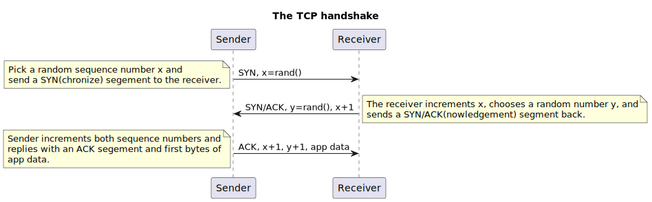

# The Study Guide 📜
- [The Study Guide 📜](#the-study-guide-)
- [Data structures and algorithms](#data-structures-and-algorithms)
  - [Runtimes 🚀](#runtimes-)
    - [Summary](#summary)
    - [O(1)](#o1)
    - [O(logN)](#ologn)
    - [O(KlogN)](#oklogn)
    - [O(N)](#on)
    - [O(KN)](#okn)
    - [O(N + M)](#on--m)
    - [O(|V| + |E|)](#ov--e)
    - [O(NlogN)](#onlogn)
    - [O(N^2)](#on2)
    - [O(2^N)](#o2n)
    - [O(N!)](#on-1)
    - [Amortized time complexity](#amortized-time-complexity)
    - [Tricks](#tricks)
  - [Hash functions and hashmaps #️⃣](#hash-functions-and-hashmaps-️⃣)
    - [Common Hash Functions](#common-hash-functions)
    - [Pigeonhole principle](#pigeonhole-principle)
    - [References](#references)
  - [Sorting 🔀](#sorting-)
    - [Summary](#summary-1)
    - [Go sort](#go-sort)
    - [Insertion sort](#insertion-sort)
    - [Selection sort](#selection-sort)
    - [Bubble sort](#bubble-sort)
  - [Trees 🌲](#trees-)
    - [Terminology](#terminology)
    - [Binary trees](#binary-trees)
    - [Binary search trees (BST)](#binary-search-trees-bst)
    - [Balanced and unbalanced binary trees](#balanced-and-unbalanced-binary-trees)
    - [Tree traversal](#tree-traversal)
  - [Heaps and priority queues ⛰️](#heaps-and-priority-queues-️)
    - [Go heap](#go-heap)
  - [Depth first search (DFS) 🔍](#depth-first-search-dfs-)
  - [Backtracking 🔙](#backtracking-)
  - [Graphs 📊](#graphs-)
  - [Dynamic programming (DP)](#dynamic-programming-dp)
- [Systems design 🖥️](#systems-design-️)
  - [The Internet protocol suite](#the-internet-protocol-suite)
    - [The reliable link layer](#the-reliable-link-layer)
  - [Load balancing strategies 🔄](#load-balancing-strategies-)
    - [Layer 4 and 7 load balancing](#layer-4-and-7-load-balancing)
    - [Load balancing failover](#load-balancing-failover)
  - [Consistency Models](#consistency-models)
    - [Linearizability](#linearizability)
    - [Strong consistency](#strong-consistency)
    - [Sequential consistency](#sequential-consistency)
    - [Causal consistency](#causal-consistency)
      - [The CALM theorem](#the-calm-theorem)
    - [Back to causal consistency](#back-to-causal-consistency)
    - [Eventual consistency](#eventual-consistency)
    - [CAP and PACELC theorems](#cap-and-pacelc-theorems)
- [Napkin math 🧻](#napkin-math-)
  - [Costs](#costs)
  - [Uptime in nines](#uptime-in-nines)
  - [Sorting](#sorting)
  - [Data storage](#data-storage)
  - [Networking](#networking)
  - [Computations](#computations)
  - [DB w/ SQL](#db-w-sql)
  - [NoSQL](#nosql)
  - [RAM disk providers (redis or memcached)](#ram-disk-providers-redis-or-memcached)
  - [Storage devices](#storage-devices)
  - [Serialization](#serialization)
  - [Hashing](#hashing)
- [General References](#general-references)

# Data structures and algorithms

## Runtimes 🚀
How long an algorithm takes to run for a given input.
Also called "time complexity".

### Summary
Runtime | Name | Example
--- | --- | --- 
O(1) | Constant | Math, assignments
O(alpha(N)) | Inverse Ackerman | Rare. Close to constant time; think O(4) at most. Appears is Disjointed Set Union.
O(logN) | Log | Binary search, binary search tree search
O(KlogN) | K linear | K binary searches
O(N) | Linear | Traverse array, tree traversal
O(KN) | K Linear | Performing a linear operation K times
O(N + M) | Linear NM | Traverse array, tree traversal on two separate collections
O(|V| + |E|) | Graph | Traverse graph with V vertices and E edges
O(NlogN) | Sort | Quick and merge sort, divide n' conquer
O(N^2) | Quadratic | Nested loops
O(2^N) | Exponential | Combinatorial, backtracking, permutations
O(N!) | Factorial | Combinatorial, backtracking, permutations
Amoritized | Amoritized | High order terms that are rarely done, smaller order done more frequently. Like doing O(N^2) once at startup and O(logN) every other time.

### O(1)
Constant time. A constant set of of operations.
- Hashmap lookups due to magic pointer arithmetic
- Array access
- Math and assignments
- Pushing and popping from a stack

```go
// Some non-looping, non-recursive code
i = 1
i = i + 100000
fmt.Println("more constant time code")
```

### O(logN)
Log time. Grows slowly. log(1,000,000) is only about 20.
- Binary searches, due to constantly splitting solution space in half
- Balanced binary search tree lookups, again cause it's halved.
- Processing number digits
Unless specified, in programmer world, we mean log base 2.

```go
for i := N; i > 0; i /= 2 {
    // Constant time code
}
```

### O(KlogN)
Typically, when you need to do a log(N) process K times.
- Heap push/pop K times, like merging N sorted lists
- Binary search K times

### O(N)
Linear time. Typically, looping thru a data struct a constant number of times.
- Traversing an entire array or linked list.
- Two pointer solutions
- Tree or graph traversal due to visiting all the nodes or verts
- Stack and queue

```go
for i := 0; i < N; i++ {
    // Constant time code
}
```

### O(KN)
Typically, when you need to process N K times. Very exciting.

### O(N + M)
Typically, when you have two inputs of size N and M. Say you loop once N times and then loop M times.
Again, very exciting.

### O(|V| + |E|)
For both DFS and BFS on a graph, the time complexity is O(|V| + |E|), where V is the number of vertices and E is the number of edges. The number of edges in a graph could be 1 to |V|^2, we really don't know. So we include both terms here.

### O(NlogN)
When we need to do a logN time process N times.
- Divide and conquer, where divide is logN and merge is N
- Sorting can get down to this.

### O(N^2)
Quadratic time. Not terrible for N < 1000, but does grow quickly.
Usually, interviewers want better than this. If you've come up
with a N^2 runtime solution, there's probably something better.
- Nested loops, where outer and inner loops run N times

```go
for i := 0; i < N; i++ {
    for i := 0; i < N; i++ {
        // Constant time code
    }
}

// OR

for i := 0; i < N; i++ {
    for j := i; j < N; j++ {
        // Constant time code
    }
}
```

The bottom loop is tricky because it's a factor of N.
So it's N^2 too.

### O(2^N)
Grows very rapidly and often requires memoization to reduce runtime.
- Combinatorial problems, backtracking, and subsets
- Often involves recursion

Note, this one is harder to analyze at first.

### O(N!)
Grows insanely rapidly. Only solvable for small N and typically requires memoization.
- Combinatorial problems, backtracking, permuations.

Note, this one is hard to analyze/spot at first.

### Amortized time complexity
Amortized time, meaning to gradualy write off the initial time costs, if an operation is rarely done. For example, if we had N^2*N tasks, we could consider the solution O(N) instead of O(N^2) = N*O(1) * O(N) if we only do the N^2 task rarely. For example, if we dynamically size an array one time at startup.

### Tricks
Note that, like the other runtimes, we ignore constant factors and lower order terms: 5N^2 + N = 5N^2 = N^2

Remember, N is sort of like infinity in math. It swallows
smaller N terms and constants. Unlike infinity, it does not swallow up other terms if multiplication is involved.
- 2N -> N
- N + logN -> N
- NlogN -> NlogN
- 3N^3 + 2N^2 + N -> N^3
- N^2 + 2^N + N! -> N!

## Hash functions and hashmaps #️⃣
In short, a hash function converts arbitrary sized data into a fixed value, typically an Int32. For example, summing all integers in an arrary and mod'ing them by 100. We convert a bunch of data or text into a smaller, ergonomic number.

Typically, you don't have to write hash functions from scratch outside of, say, for GetHashcode for .NET objects or similar.

A hash collision occurs when a hash function generates the same hash value for different data.

A good hash function is typically:
- Fast to compute (low time complexity or runtime)
- Very low chance of collision
- All possible values have a somewhat equal chance of occuring.

### Common Hash Functions
Name | Description
--- | ---
SHA | Cryptographic hash. SHA-3 is the lastest. SHA-2 and -1 have vulnerabilities now.
Blake2 | An improvement over SHA-3, high speed and used in crypto mining.
Argon2 | Password hashing function designed to be resistant to brute force or dictionary attacks. Uses large amount of memory (memory-hard) to make attacks more difficult, for hackers using specialized hardward to crack passwords.
MurmurHash | Fast an efficient non cryptographic has. Useful for hash tables.
CRC | Cyclic redundancy check. Non cryptographic. Fast, but not used for security. Typically, the CRC is appended to messages, like HTTP, to check for corruption.
MD5 | Fast 128 bit hash, but no longer recommended for security.

### Pigeonhole principle
Collisions are unavoidable, so we need to design around it. For example, if "anne" and "john" created the same hash, we'd overwrite the same hashtable entry. To avoid this, we can use [separate chaining](https://en.wikipedia.org/wiki/Hash_table#Separate_chaining) or other strategies.

### References
[List of hash functions](https://www.geeksforgeeks.org/hash-functions-and-list-types-of-hash-functions/)

## Sorting 🔀
- Time complexity = The amount of time it takes to sort the collection as a function of the size of the input data, represented in big O notation. Basic sorting is usually N^2, advanced are usually NlogN.
- Stablility = If two elements have equal keys, then the order of these elements remains unchanged. This can be valuable for historical data, user expectations, or multi-criteria sorts where not sorting equal elements is important.
- In-place = The sorting algorithm sorts the input data structure without need to allocate additional memory to store the sorted results. This is valuable for large data sets.
- Simple = Simple algorithms are those that are relatively straightforward to implement with a one or two loops. The more complicated algorithms like quick and merge sort use divide and conquer strategies. This does not mean they are super easy to just bang out, however.
- Adaptable = Sometimes, input data are already somewhat sorted and we can minimize the number of comparisons that we need to make. For example, gnome sort is O(N) for an already sorted collection!
- Parallelizable = The sorting algorithm can divide the the sorting into subtasks that can be executed in parallel. Merge, quick, radix, and bucket sorts are all parallelizable due to divide and conquer.

### Summary
A summary of common algorithms, courtesy of ChatGPT.
| Algorithm            | Time Complexity (Worst Case) | Stable | In-Place | Adaptable | Parallelizable | Description                                              |
|----------------------|-----------------------------|-----------|----------|-----------|-----------------|----------------------------------------------------------|
| Bubble Sort          | O(n^2)                       | Yes       | Yes      | Yes       | Yes (limited)   | Repeatedly compares and swaps adjacent elements.          |
| Selection Sort       | O(n^2)                       | No        | Yes      | No        | Yes (limited)   | Repeatedly selects the minimum element and swaps with the current position. |
| Insertion Sort       | O(n^2)                       | Yes       | Yes      | Yes       | Yes (limited)   | Builds the sorted list one element at a time by inserting into the correct position. |
| Merge Sort           | O(n log n)                   | Yes       | No       | Yes       | Yes             | Divides the input into halves, recursively sorts them, and merges them. |
| Quick Sort           | O(n^2) (rare), O(n log n)    | No        | Yes      | Yes       | Yes (limited)   | Chooses a pivot, partitions the data, and recursively sorts the partitions. |
| Heap Sort            | O(n log n)                   | No        | Yes      | No        | Yes             | Builds a binary heap and repeatedly extracts the maximum element. |
| Shell Sort           | O(n log^2 n) (worst known)   | No        | Yes      | No        | No              | A variation of insertion sort with multiple passes and varying gap sizes. |
| Radix Sort           | O(nk) (k is the number of digits) | Yes  | Yes      | No        | Yes             | Processes digits or elements in multiple passes, each pass sorted independently. |
| Bucket Sort          | O(n^2) (worst case)           | Yes      | No       | Yes       | Yes             | Distributes elements into buckets and sorts each bucket independently. |

### Go sort
In, go you don't need to author your own sorting algorithm. You can use slices.Sort or similar.
```go
arr := []int{5, 3, 1, 4, 2}
slices.Sort(arr)

// OR

cmp := func(a, b int) int {
  if a == b {
    return 0
  } else if a > b {
    return 1
  }

  return -1
}

slices.SortFunc(arr, cmp)
```

### Insertion sort
```go
func InsertionSort(arr []int) {
	for i := 1; i < len(arr); i++ {
		// This is the magic. j starts at the ith element and walks smaller elements to the front of the array.
		// So, while j-1 > j, swap it so that j-1 < j and decrement j. Note j > 0 cause we're doing j-1 stuff.
		for j := i; j > 0 && arr[j-1] > arr[j]; j-- {
			sliceutil.Swap(arr, j-1, j)
		}
	}
}
```

### Selection sort

### Bubble sort

## Trees 🌲
Trees are a type of graph composed of nodes and edges.
- Trees are acyclic, nodes don't loop back to themselves and create cycles.
- There's a path from the root node to any other node.
- Trees have N-1 edges, when N is the number of nodes.
- Nodes have exactly one parent node.
- Trees are directed.
- Trees are rooted.

### Terminology
Name | Description
--- | ---
Root node | The top most ancestor node, one with out any parents.
Internal node | Every node that has at least one child.
Leaf node | Every node that does not have any children.
Ancestor | All nodes between the path from the child to the parent.
Descendent | All nodes between the path from a parent to the child.
Level | Number of ancestors from the current node to the root.
Arity | Number of operators or terms. For trees, where each node has no more than N-ary children.

I dislike ancestor/descendent. Call 'em parent and child like we're all 5 years old.

Example of a tree:
```
    A
   / \
  B   C
 / \   \
D   E   G
```
- A through G are all nodes.
- / and \ are edges. There's N-1 = 6-1 = 5 edges and 6 nodes.
- A is the root node.
- D, E, and G are all leaf nodes.
- A, B, and C are internal nodes.
- A is at level 0, B and C at level 1, and D, E, and G at level 2.
- A is a parent of B and C. B is a parent of D and E. C is a parent of G. D, E, and G are leaf nodes and have no children themselves.
- D and E are a child of B. G is a child of C. B and C are children of A. A is the root node and has no parents.

### Binary trees
Binary trees are a tree where each node has 0 to 2 children.

A full binary tree is one in which every node has 0 or 2 children. 1 is not allowed.
```
      x
     / \
    x   x
   / \
  x   x
 / \
x   x
```

A complete binary tree is where all the levels, except the last, are completely filled out. In the last level, the nodes are as far left as possible. This shows up in heaps.
```
      x
     / \
    x   x
   / \
  x   x
```

A perfect binary tree is one in which all the internal nodes have exactly 2 children. 1 or 0 are children are not allowed. All leaf nodes have the same number of children.
```
       x
     /   \
    x     x
   / \   / \
  x   x x   x
```
Perfect trees are used to estimate time complexity for combinatorial problems where the search space is a perfect binary tree. They have some unique properties.
- The number of nodes is 2^L-1 where L is the number of levels.
- The number of internal nodes is # of leaf nodes - 1.
- The total number of nodes is = 2 * leaf nodes - 1.

### Binary search trees (BST)
BSTs are a special type of binary tree where all left descendents < node < all right descendents.
```
      8
     / \
    3   10
   / \    \
  1   5    14
       \
        7
```
Notice that 3 is to the left of 8 because 3 < 8. Similarily, 14 is to the right of 10.
Note that the in-order traversal of the tree visits the nodes in monotonically increasing order.

### Balanced and unbalanced binary trees
Unbalanced trees are have a search time of N. The start to look more like a list than a tree.
```
1
 \
  2
   \
    3
     \
      4
```
Balanced binary trees are those where the difference in height (levels) between the left and right subtrees of all nodes is not more than 1. Balanced trees allow for a search time of logN.
```
      8
     / \
    3   10
   / \    \
  1   5    14
       \
        7
```

Balanced binary trees include [red-black](https://en.wikipedia.org/wiki/Red%E2%80%93black_tree) and [AVL](https://en.wikipedia.org/wiki/AVL_tree) trees.

### Tree traversal
Tree traversal are types of traveling through the nodes of a tree.
- In-order visits the left branch, current node, then right branch.
- Pre-order visits the current node, left subtree, and right subtree.
- Post-order visits the left subtree, right subtree, and current node.

For example, given the following binary search tree,
```
     8
    / \
   3   10
  / \    \
 1   5    14
      \
       7
```
the visits to each node would be:
- In-order: 1 3 5 7 8 10 14
- Pre-order: 8 3 1 5 7 10 14
- Post-order: 1 7 5 3 14 10 8

## Heaps and priority queues ⛰️
A min heap is a special tree data structure where
1. Almost complete - every level in the tree is almost filled, except the last level. The last level is left justified.
1. Each node has a greater key (priority) than it's parent.

Here's a heap structure:
```
       1
     /   \
    2     3
   / \   / \
  7   8 9   11
  |
  12
```

This is not a heap:
```
       1
     /   \
    2     3
   / \   / \
  7   8 9   11
  |
  5 // Need to heapify this, 5 < 7, so our heap property is broken
```

Also, not a heap:
```
       1
     /   \
    2     3
   / \   / \
  7   8 9   11
      |
      12 // Need to left justify this
```

Also, not a heap:
```
       1
     /   \
    2     3
   / \   /
  7   8 9 // Need to fill intermediate levels
  |
  12
```

Couple notes:
- Max heaps are the same, but we just change the each-child-key-is-greater property to each child is less.
- Usually, heaps are binary tree, but you can also get k-ary heaps or k-heaps.
- A priority queue is an abstraction on the heap, a min/max heap is the concrete implementation.
- They are typically implemented with an array.
- It's a sorted tree but it is not a binary search tree.

Heaps support three main operations:
1. Heapify - Rearrange the nodes such that the heap such that the nodes are in min keys are always the at the root. This is an O(logN) operation.
2. Insert - Inserts a new element into the heap and calls heapify because to maintain the heap properties. This is an O(logN) operation.
3. Pop/Delete - Removes and returns the min root element. Another O(logN) operation.

In it's use, it's sort of like a stack. Push nodes in, pop nodes out except you always get the min keyed node.

### Go heap
We don't have to author a heap from scratch.
In go, we can use the alias a slice type and implement heap.Interface on it:
```go
// Alias a slice type
type MinHeap []int

// And implement the heap.Interface type.
var _ heap.Interface = (*MinHeap)(nil)

func (h *MinHeap) Len() int {
	return len(*h)
}

func (h *MinHeap) Less(i int, j int) bool {
	return (*h)[i] < (*h)[j]
}

func (h *MinHeap) Pop() any {
	result := (*h)[h.Len()-1]
	*h = (*h)[:h.Len()-1]
	return result
}

func (h *MinHeap) Push(x any) {
	*h = append(*h, x.(int))
}

func (h *MinHeap) Swap(i int, j int) {
	(*h)[i], (*h)[j] = (*h)[j], (*h)[i]
}

func TestHeap(t *testing.T) {
	// Create an empty MinHeap
	h := &MinHeap{}

	// Push elements onto the heap h, using heap.Push(h, whatever)
	heap.Push(h, 3)
	heap.Push(h, 1)
	heap.Push(h, 4)
	heap.Push(h, 2)

	// Pop elements from the heap h (retrieve in sorted order for a min-heap)
	// using the heap.Pop(h)
	for h.Len() > 0 {
		fmt.Printf("%d\v", heap.Pop(h))
	}
}
```

## Depth first search (DFS) 🔍
A depth first search looks for solutions by going deep first. That is, it searches
for solutions in a pre-order traversed way. Some more terminology:
- Backtracking - returning after visiting a non-solution node
- Divide and conqueror - When we have two or more recursive calls, that splits our issue into subproblems, like O(logN).

When do we use a DFS? We can use them in
1. Trees
  - Traverse through a tree to find, create, delete nodes
  - Traverse through a tree to find the max subtree, detect a balanced tree, etc.
2. Combinatorial problems
  - Find all the different ways of arranging something
  - Find all possible combinations of something 
  - Find all solutions to a puzzle
3. Graphs
  - Find a path from A to B in a graph
  - Find connected components
  - Detect cycles

There are two main ways of coding a DFS. We can use recursion or we can use a stack + loop.
1. With recursion, we call the recursive func on the next state.
2. With a loop, we pop off a stack, add any possible solutions, and then keep going.

One thing to keep in mind with DFS, is kicking state into and out of the recursive functions and/or stack.

The template for a DFS via recursion is
```
function dfs(node, state):
    if node is null:
        ...
        return

    left = dfs(node.left, state)
    right = dfs(node.right, state)

        ...

    return ...
```

The main hard parts of DFS are 1. deciding which state to pass in, 2. deciding which state to pass out and 3. sorting out the recursive calls.

Now, sometimes, when solving DFS problems, we need to
- Pass information back up through the return value, like the max depth.
- Pass information about state into the recursive calls, like max value
Alternatively, we can store state, say a max number, in a global variable.

## Backtracking 🔙
Backtracking tacks on some new concepts on top of trees and DFS.
1. We can make the tree as we go, creating and deleting child nodes as we traverse through.
2. We can drag state around via parameters/returns or with global/struct variables.
3. If we get some crazy 2^N to N! memory usage with backtracking combinatorial problems, we may need to memoize intermediate solutions to cut down on memory usage. For a small to mid N, N! will kill our poor computer. Memoize typically means using a map or similar to store intermediate and final solutions to the combinatorial problems.

## Graphs 📊
Trees are rooted, connected, acyclic, undirected graphs. Trees contain N nodes and N-1 edges and there are only one path between 2 nodes.

This is a tree (and a graph):
```
    1
   / \
  2   3
 /
4
```

This is only a graph due to the cycle and disconnected vertex.
```
    1
   / \
  2 - 3   // Cycle among nodes 1, 2, and 3

4         // Node 4 is disconnected from others
```

Trees and graphs have different terminology
- Verticies are nodes in trees.
- Verticies are connected by edges.
- Verticies connected by an edge are neighbors (children and parents in trees).
- Edges can be directed or undirected. Usually the edges are undirected.
- Paths are sequences of verticies. Cycles start and end at the same vertex.
- A connected graph means every vertex is joined by a path to a vertex; otherwise, the graph is disconnected.


Typically, graphs are stored via adjaceny lists or maps. For example, this graph
```
    1
   / \
  2   3
 /
4
```

can be represented in go via a map like

```go
graph := map[int][]int{
  1: {2, 3},
  2: {1, 2, 3},
  3: {1, 2},
  4: {2},
}
```

Note that we don't need to have an adjacency list upfront to solve problems.

So, for BFS and DFS on the graph, we can do the stack/queue dance through it. However, we need a way to dodge any cycles or we'll get stuck in an inf loop or stack overflow. To do this, we can store a map of visited nodes when searching. Like

```go
visited := make(map[int]bool)
visited[1] = true
```

Another clever trick is to wipe out the value in the adjancency graph somehow. Make it negative or something that indicates we visited it to avoid storing a whole other data structure for visited/not-visited stuff.

When deciding between BFS or DFS to explore graphs, choose BFS for shortest distance or graphs of unknown or infinite sizes due to exploring all adjacent neighbors first.

DFS is better at using less memory for wide graphs (graphs with large breadth of factors). Put another way, BFS stores the breadth of the graph as it searches. DFS is also better at finding nodes that are far away such as a maze exit.

## Dynamic programming (DP)
A problem can be solved via dynamic programming if
1. The problem can be divided into sub-problems
2. The sub-problems from bullet 1 overlap

Really, DP == DFS + memoization + pruning. Pruning is important, to save space and reduced wasted calculations.

In DP, the formula used to tabulate, like dp[i] = dp[i - 1] + dp[i - 2], is called the recurrene relation and is critical.

# Systems design 🖥️

## The Internet protocol suite


### The reliable link layer

The TCP handshake introduces a full round-trip before any app data is sent. Until a connection is opened the bandwidth is effectively zero. The faster a connection is established, the sooner communication can begin. Ergo, reducing round-trip time by moving servers next to each other reduces the cold
start penalty.



Closing the connection, on the other hand, involves multiple round-trips. Additionally, if another connection might occur soon, it doesn't make sense to close the connection so it might stay open.


## Load balancing strategies 🔄
Name | Description
--- | ---
Round robin | Sling requests to servers in order, one at a time. LB1 -> LB2 -> LB3 repeat.
Weighted round robin | Some servers are more powerful than others. We can give more requests to the stronger servers. Say LB2 is stronger, we could do LB1 -> LB2 -> LB2 -> LB3.
Least connections | Sometimes, a server might draw the short straw and get overwhelmed with a bunch of long running requests. This is a dynamic LB strategy where we give requests to servers with the least active of connections.
Weighted least connections | Similar to least connections. Servers are dynamically scored based on the servers resources.
Resource based (adaptive) | The LB can get health checks from the servers and their overall health. Scores and requests can be dynamically assigned based on the servers returned status check.
Resource based, (Software defined network adaptive) | Using OSI layers 2, 3, 4, and 7, the LB can make optimized traffic decisions based on network congestion or similar.
Fixed weighting | Servers are assigned a scored (weighted). The highest score will get the requests and then failover to the next highest score. This one is useful where a single server is expected to handle all the traffic but be assigned a failover server.
Weighted response time | The LB can use a server's response time to decide where to send traffic. The fastest server wins the next request.
Source IP hash | The source and destination IPs are hashed and used to direct requests. This one is useful if all requests need to go to the same server.
URL hash | Similar to source IP hash except the requested URL is used instead and helps ensure requests are sent to the same servers.

### Layer 4 and 7 load balancing
Load balancers can make routing decisions based on information extracted from bytes in the TCP stream (transport layer 4) or from the HTTP header, cookies, or resource type (application layer 7). Note that, layer 4 vs 7 is talk here is intended to be more useful for learning than 100% accurate. It's more complicated than pick layer 4 vs 7 - done.

- Layer 4 requires less computing resources as there's less protocols to process, you maybe don't have to wait for the entire packet, etc.

- Layer 7 load balancing is often desired for sheer flexibility since, at layer 7, we have a full understanding of the request being made.

Typically, hardware nowadays is powerful enough to make layer 7 LBs outweigh layer 4 LBs.

### Load balancing failover
A single LB presents a single point of failure. If the single load balancer goes down, then the whole system behind it goes down as well. To maintain availability, we can have multiple load balancers in active-active or active-passive configurations.
- Active-active = There are multiple, ready LBs in use. If one active goes down, then another is ready to take the additional load.
- Active-passive = One LB is active, another LB is in standby. The standby LB is ready to hop in if the active one goes down.

The more nines you need, the more LBs you'll need to supply.

References:
- [Load balancing algorithms](https://kemptechnologies.com/load-balancer/load-balancing-algorithms-techniques)

## Consistency Models
Distributed systems are often modeled around consistency models which define how the updates to a distributed system are observed. With different models, you may see data visibility, ordering of operations, performance differences, fault tolerance, ease of implementation, and ease of maintenance. In short, as a system becomes more available, it becomes less consistent.

### Linearizability
Also known as atomic consistency. This is a specific form of strong consistency which adds real-time ordering constraints to operations.
- At some point, the operation appears to occur instantly, called the linearization point.
- This is a stronger form of consistency than strong (lol, great, not confusing at all) due to the stringent ordering.
- It's also probably the slowest due to the ordering, synchronizing, and coordination involved. Getting all the computers to agree (coordination) takes time.
- The emphasis is all on real-time ordering. When clients check back later, the linearized system updates the data between reads.

ChatGPT says,
> "Imagine you and your friend Alice have magical walkie-talkies. With linearizability, when you send a message to Alice, it's like she receives it instantly, and her response also comes back to you immediately. It's as if the messages are magically happening at the same time."

### Strong consistency
Strong consistency ensures all nodes have the same view of data at any given time.
- All operations appear to be synchronous and read operations appear to return the most recent write.
- Typically uses distributed locks to agree on the order of operations.

ChatGPT says,
> "Strong consistency is like having a rule that everyone, including friends in different rooms, always has the same information at the same time. If you say something to Alice, all your friends instantly know about it. It's like the information spreads quickly to everyone."

### Sequential consistency
Sequential consistency ensures operations occur in the same order for observers but does not make any real-time guarantees about when an operation's side effect becomes visible. There's a boost in performance but we drop some consistency on the ground. A read from Server A may appear different than Server B, but the operations are sequential so Server A and B will eventually converge and agree. In other words, the replicas are diverging on their view of the world.

A producer/consumer system, synchronized with a message queue, is an example of a sequential concistency. The consumer lags behind the producer.

ChatGPT says,
> "Now, let's say you and Alice have regular walkie-talkies, but you both agree to take turns talking. So, the messages go back and forth in the order you send them. It's like having a clear order for your conversation."

### Causal consistency
Causal consistency relaxes some guarantees of strong in favor of speed. Causal guarantees that causally related operations are in a consistent order and preserves causality. Before we continue, we need to discuss the CALM theorem quickly. So, stay CALM (Get it? Stay calm!!? About the theorem? Funny, right?)

#### The CALM theorem
The Consistency As Logical Monotonicity (CALM) theorem uses logic to reason about distributed systems and introduces the idea of monotonicity in the context of logic. CALM tells us we can get to coordination-free distributed implementations only if the system is monotonic.

Logically monotonic means that the output only further refines the input and there's no taking back any prior input.

Very important note: The consistency in CALM is not the same as the consistency in CAP.

Variable assignment is non-monotonic. When you assign something to a variable, the previous value is gone forever. Take a counter value that does

write(1), write(2), write(3) => 3
but then if they show up out of order:
write(1), write(3), write(2) => 2

We end up with the wrong value.

In contrast, incrementing allows us to reorder in any way and still get the correct output:
increment(1), increment(1), increment(1) => 3

### Back to causal consistency
Back to causal consistency. Causal maintains happend-before order (the causal order) among operations. This makes causal attrative for many applications because:
- It's consistent "enough" and easier to work on the eventual consistency.
- Allows building a system that's available and partition tolerant.

This requires that nodes *agree* on the causally related operations but may *disagree* on the order of unrelated ones. Put another way, the nodes preserve the logical order.

Causal systems are typically backed by conflict-free replicated data types (CRDTs), such as
- Last writer wins (LWW) - Values are associated with a logical timestamp/version. When the value is broadcasted, nodes only keep the greatest timestamp. Conflicts due to concurrent updates are usually resolved by taking the greater timestamp, but this might not always make sense.
- Multi-value (MV) - Store the operations in a log of operations that all nodes share. New values are inserted into the MV register. Systems will need to share out their MVs.

ChatGPT says,
> "With causal consistency, you and your friends agree on some logical order for the messages. If you tell something important to Alice and then mention it to Bob, everyone knows that Alice got the message first. It's about maintaining the cause-and-effect relationship."

### Eventual consistency
Eventual consistency relaxes guarantees of strong and sequential. Given enough time, all nodes will converge to the same result. Note that, during updates or partitions, nodes may have different values. For example, reading from Server A and B may yield a stale, earlier result which is very confusing.

Imagine uploading an image to a social network and add it to gallery. Except, when you try to view the gallery, you get a 404; strangely, you already received a message upload success message! Very odd to an observer, but very real in distributed world.

Regardless, eventual can be appropriate tradeoff for certain systems. Slightly different results are perfectly acceptable to achieve higher speeds such as returning the number of users on a website. The number of active users can be stale, and it's typically not a big deal. Note that eventual consistency can be a maintenance burden due to subtle, unexpected bugs.

ChatGPT says,
> "Now, suppose your friends have regular walkie-talkies, and sometimes messages take a while to reach everyone due to delays. Eventual consistency says that, given enough time without any more messages, eventually, everyone will have the same information. It's about waiting until things settle down."

### CAP and PACELC theorems
["CAP Theorem: You don't need CP, you don't want AP, and you can't have CA"](https://www.youtube.com/watch?v=hUd_9FENShA)

Engineering is, in part, about tradeoffs. Distributed systems are no different. CAP theorem, can be summarized as "strong consistency, availability, and partition tolerance: pick two of three." Except...
- Network partitions are simply unavoidable, so you really just get to pick between availability and consistency
- But, also, CAP defines available as *eventually* getting a response but we know that perfect availability is impossible
- And also a slow response is as bad as not receiving one at all.
- Network paritions are rare in a data center. It can certainly happen though.

So, while helpful, CAP is limited in its practical application. This is, again, about tradeoffs. The PACELC theorem, an extension of CAP, expresses this as, when a network is partitioned (P), choose between availability (A) and consistency (C). Else, when operating normally (E), choose between latency (L) and consistency (C). We see that this is not some binary choice between AP and CP, but rather a spectrum of tradeoffs between the various consistency models and latency. Indeed, some systems like [Azure's Cosmos DB](https://learn.microsoft.com/en-us/azure/cosmos-db/consistency-levels) allow you to choose the consistency model you want which is neat.

# Napkin math 🧻
Also known as back of the envelope calculations.

Note that these numbers are heavily rounded for memorizing. We want to be in the ballpark for creating useful mental models.

## Costs
Name | $/time/quantity | Description
--- | --- | ---
Core | $10/mo/core | Cost of cloud computing cores per month (typically have many)
SSD | ¢10/mo/GB | Cost of SSD storage per month GB
HDD | ¢1/mo/GB | Cost of a HDD storage per month per GB
CDN | ¢1/mo/GB | Cost in AWS or GCP for CDN storage per month per GB
Network | ¢1/mo/GB | Networking utilization costs in AWS or GCP per month per GB

## Uptime in nines
Obviously, zero downtime in systems is ideal, but this ain't realistic. We want as close as financially reasonable to 100% up time. The nines themselves don't really tell you the actual amount of downtime allowed. What's 99.99% of 365 days? Why, it's 0.0365 days obviously! Yeah, no, still not helpful. Memorize the times. Note that the values in the chart are intended to be "memorization friendly". You get a ballpark, gut feel from the amount of downtime being discussed. If you need perfect numbers, then actually bust out a calculator.

No. of Nines | % | Annual downtime | Daily downtime
-- | --- | --- | ---
1 nine | 90% | 36days | 150min
1.5 nines | 95% | 18days | 75min
2 nines | 99% | 4days | 15min
3 nines | 99.9% | 9hrs | 2min
4 nines | 99.99% | 1hr | 10s
5 nines | 99.999% | 5min | 1s
6 nines | 99.9999% | 30sec | 100ms

Also note that downtime among serial systems is typically additive because we can't assume downtime overlaps. In otherwords, two, 6-nine services in serial will not yield 6-nines of down time. The worst case downtime would be 1 min (1min > 30sec, so not 6 nines). If we have a pipeline with services A -> B -> C, each service with 10 minutes of annual downtime, then it's 30 minutes of downtime total, in the worst case.

You may need to consider LBs+1, LBs+2, or 2*LBs. The more nines, the more expensive it is.

## Sorting
We need to memorize a basic sorting algorithm, like insertion sort:
```go
func InsertionSort(arr []int) {
	for i := 1; i < len(arr); i++ {
		// This is the magic. j starts at the ith element and walks smaller elements to the front of the array.
		// So, while j-1 > j, swap it so that j-1 is < j and decrement j. Note j > 0 cause we're doing j-- stuff.
		for j := i; j > 0 && arr[j-1] > arr[j]; j-- {
      arr[j-1], arr[j] = arr[j], arr[j-1] // Swap
		}
	}
}
```

## Data storage

## Networking

## Computations

## DB w/ SQL

## NoSQL

## RAM disk providers (redis or memcached)

## Storage devices

## Serialization

## Hashing

# General References
- [System design primer on GitHub](https://github.com/donnemartin/system-design-primer)